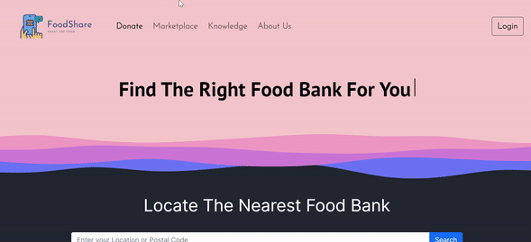
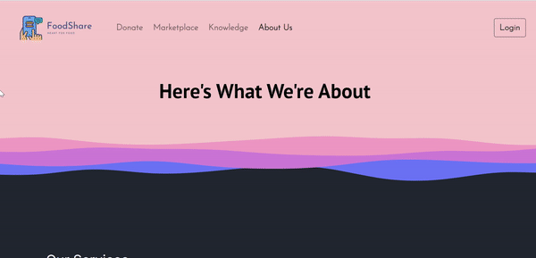
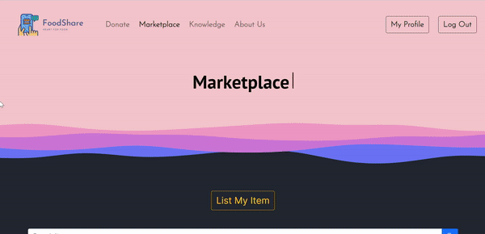

# FoodShare

Foodshare is a web application that aims to tackle food wastage and scarcity in the UK. This is done through including 3 features, namely, Donate, Marketplace, and Knowledge, to raise awareness on food scarcity and to ease to process of donating and sharing food.

## Demo

Here is a working live demo : https://wad2-foodshare.web.app/about.html

## Features

Donate

- Aids users in locating the nearest food bank to them
- Informs users of the food banks' food needs in real time
- Uses Give Food API, Google Maps API

Marketplace

- A place where users can search for food items that they might want
- Connects users with others who may want their food items
- Users can also list their items on the marketplace after they have logged in (To list items: Go to section "How to List Items on Marketplace" to view a tutorial)
- Recommends recipes for users to try with selected food items
- Uses Recipe Search and Diet API
- Cloudinary and Firebase used as data storage for food listings

Knowledge

- Builds awareness for the cause by curating relevant news articles
- Engages users through fun food quizzes; Uses Trivia API, Web Search API

## Registering For An Account

See the GIF below to see how to register an account:

## How to List Items on Marketplace

See the GIF below to see how to list a food item on the marketplace:

## Solution

- Front-end framework - VueJS ; Bootstrap

- Database - Cloudinary ; Firebase Cloud Firestore

- Authentication - Firebase; Firebase Authentication

## APIs used
- [Give Food API](https://www.givefood.org.uk) - Largest public database of UK Food Banks and items requested

- [Recipe Search and Diet API](https://rapidapi.com/) - Over 2 million recipes with calories and diet preferences

- [Trivia API](https://api-ninjas.com) - Provides random trivia questions and answers 

- [Google Maps API](https://maps.googleapis.com/) - Customises and displays maps with own content

- [Web Search API](https://rapidapi.com/) - Gets news articles that are trending on the web

## User Authentication
Firebase Authentication:
- Used to facilitate user account creation and login via email/password provider and the creation of a unique user-id
- Integrates with Firestore in storing and retrieving user's listing data

## Data Storage
Firestore
- A cloud-based NoSQL database
- Stores data in documents
- Organises them into collections

## Beyond-The-Lab
- Code is pushed from local devices or merged from other branches to the GitHub repository
- GitHub Code is deployed to Firebase hosting

## Authors and acknowledgment

- Ian Chia Chern Yi
- Yan Jiaxing
- Mohammad Zuhaili Bin Amin
- Tan Yan Lin, Valencia
